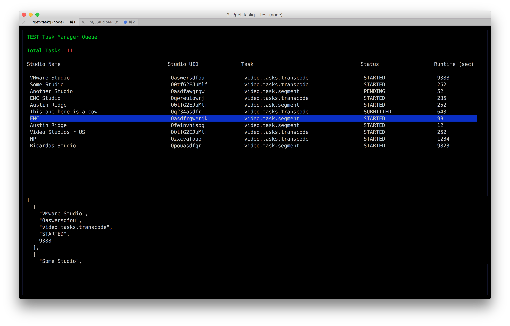

# task manager queue view

A command line task management queue viewer. Testing out the use of blessed nodejs library for possible use in a command line task queue viewer.



(abandoned in favor of a web/react based solution)

## Installation

Install dependencies with:

```
$ npm install
```

## demo mode

To try this out in demo mode, simply run the fake task mgr server first:

```
$ ./server.js &
```

then use the `--test` option to `get-taskq`.

```
$ ./get-task --test
```

if you want to use the real task manager, you can setup either the `STAGE_TASKMANAGER_URL` or `PROD_TASKMANAGER_URL` environment variables to point to the respective servers and then use either the `--stage` or `--prod` options.
